# RMRR DeepStack model fire
A concept [DeepStack](https://github.com/johnolafenwa/DeepStack) YOLOV5 model for detection emergencies in my valley from my tower / sky cams. Mainly fires and Starflight fly overs.

See [Convert and Merge example](https://github.com/avatar42/deepstack/wiki/ConvertAndMerge) for details on its creation and 0.X versions.

Note training images ck*.jpg are from the [Kaggle WildFire-Smoke-Dataset-Yolo](https://www.kaggle.com/ahemateja19bec1025/wildfiresmokedatasetyolo) dataset though the mappings are mostly altered to better align with my detection goals.


## How to use:

To use the model download the `fire.pt` file to your `C:\DeepStack\MyModels` folder. (Can be any folder but Blue Iris defaults to C:\DeepStack\MyModels)

1. Add a folder inside your DeepStack instance (If you run on Host) or mount it in Docker.

2. Run DeepStack with the command `--MODELSTORE-DETECTION "C:/DeepStack/MyModels"` See [DeepStack utils](https://github.com/avatar42/deepstack) for more info on setting up and testing your set up.

3. To use RMRR detection call the end point `/v1/vision/custom/fire` with your picture and you get a response similar to this if it finds a known object:

```python
{
'success': True,
'predictions': [{
  'confidence': 0.93365675,
  'label': 'fire',
  'y_min': 279,
  'x_min': 640,
  'y_max': 340,
  'x_max': 767
  }]
}
```

The list of currently trained for objects in in [fire_classes.txt](./fire_classes.txt)

[trainTest](https://github.com/avatar42/deepstack/blob/main/trainTest.py) results are in [train/trainTest.results.txt](https://github.com/avatar42/RMRR.fire/blob/main/train/trainTest.results.txt)

[debug.pics](https://github.com/avatar42/RMRR.fire/tree/main/debug.pics) contains training run debug images highlighting where the model did not fully align with expected results, suggested map changes and such.

For more details on training see [DeepStack training](https://securitycam101.rmrr42.com/2021/12/deepstack-training.html)

For more help setting and or debugging a DeepStack setup see [Quick Blue Iris with DeepStack debug](https://securitycam101.rmrr42.com/2021/10/quick-blue-iris-with-deepstack-debug.html)

See [runTrain.bat](runTrain.bat) for an example of running training locally with my [DeepStack Utils repo](https://github.com/avatar42/deepstack) style setup.

# Training results
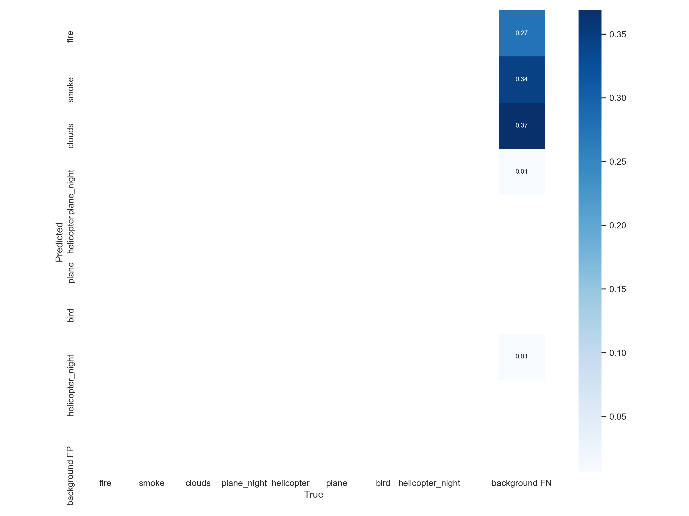
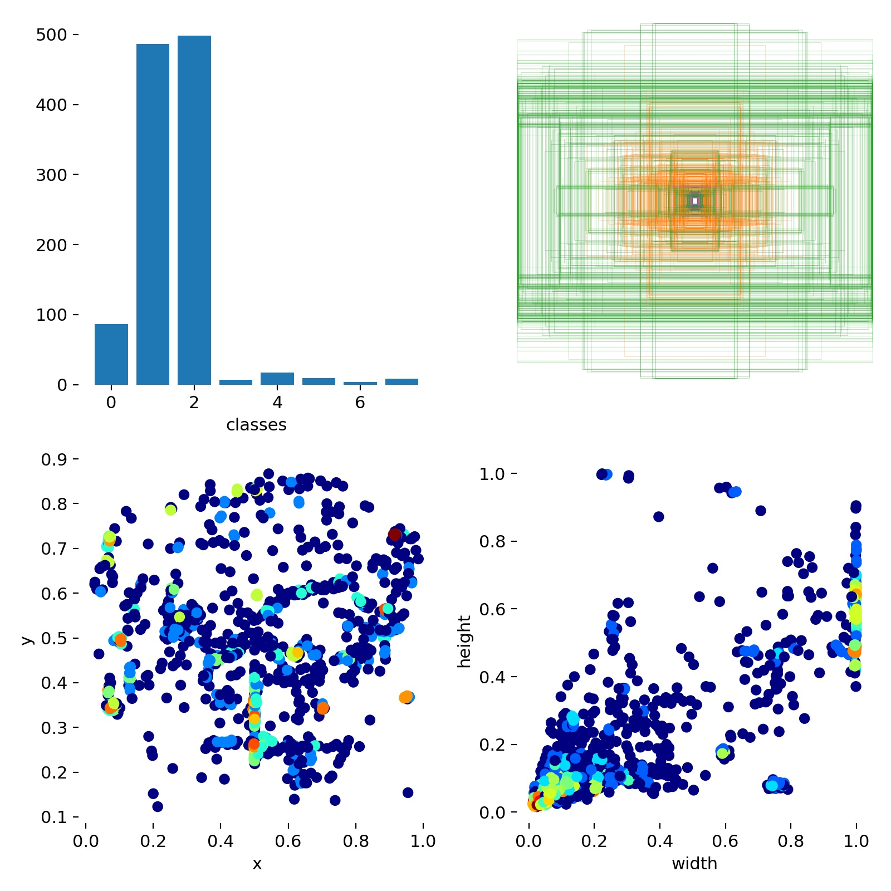
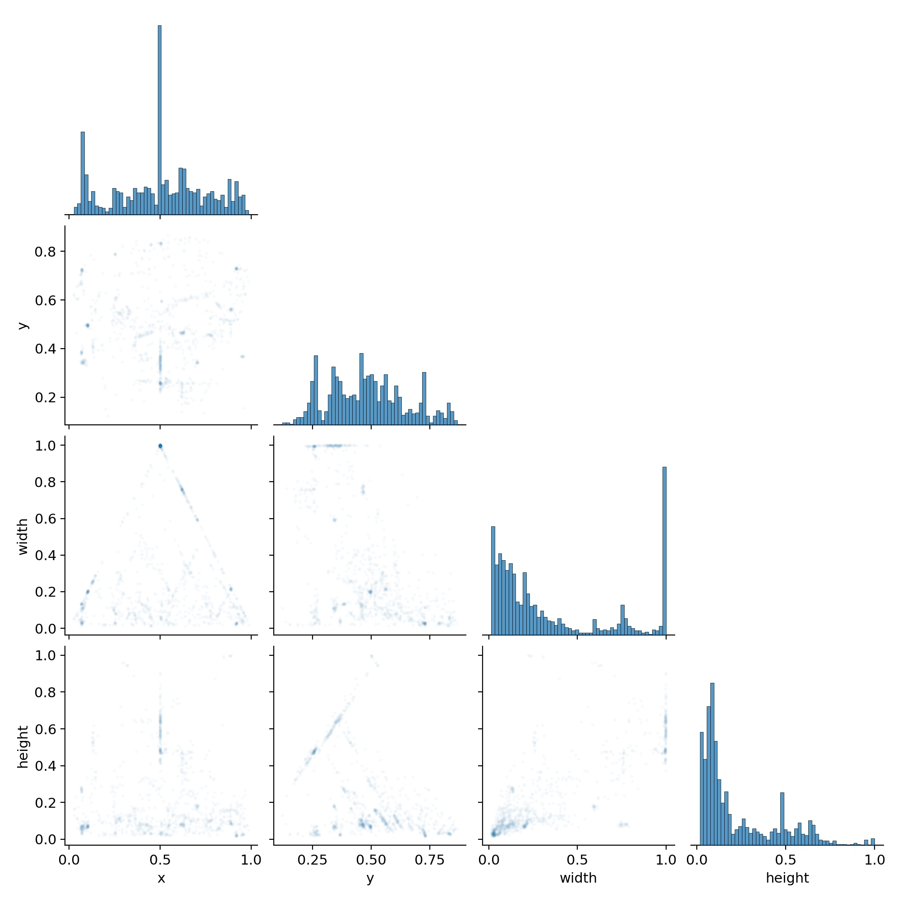
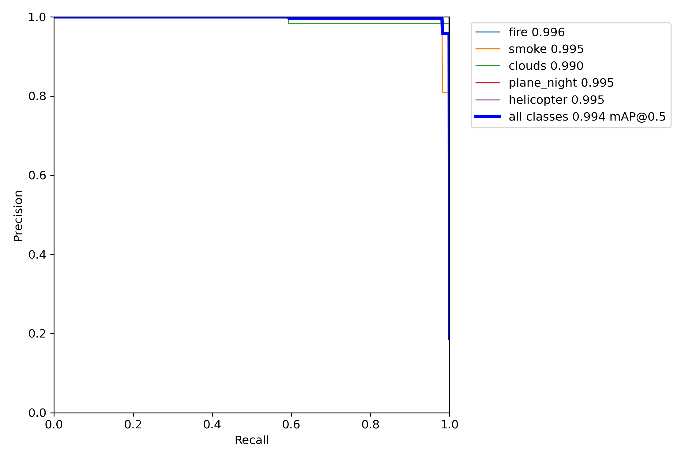
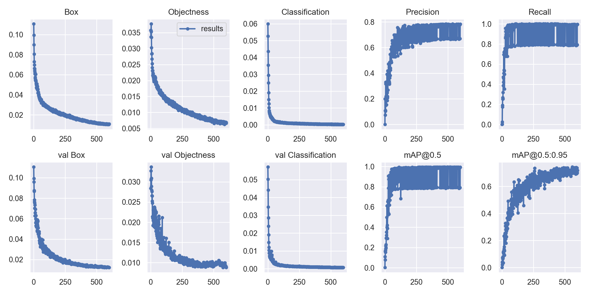
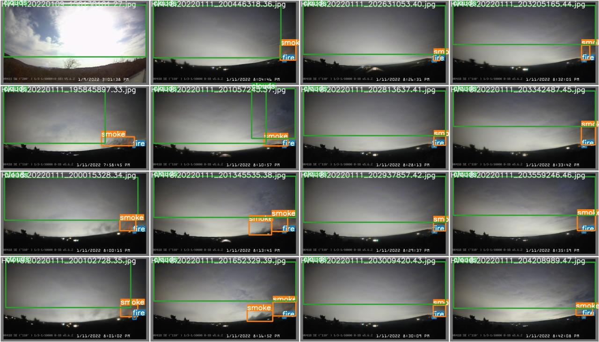
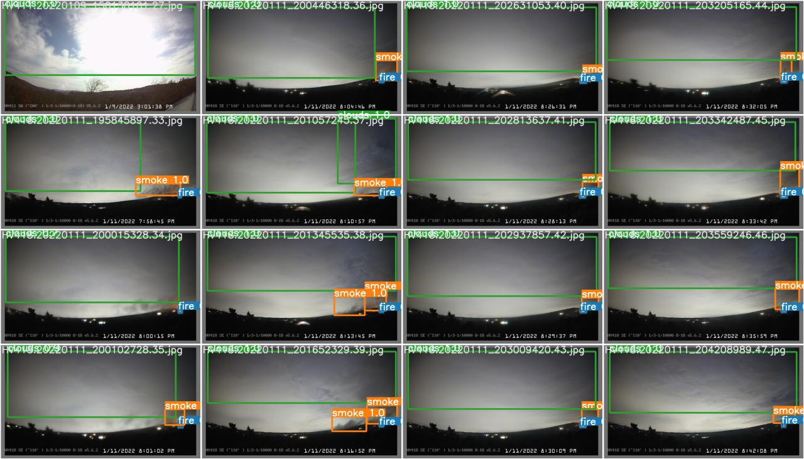

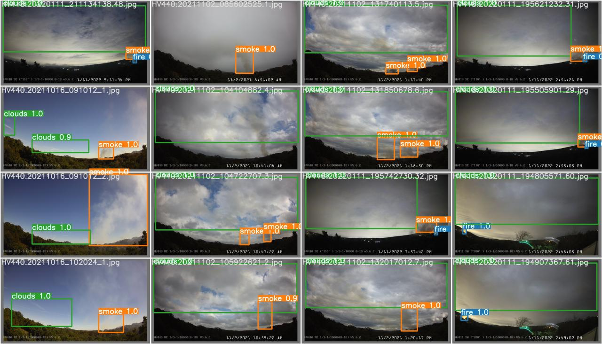
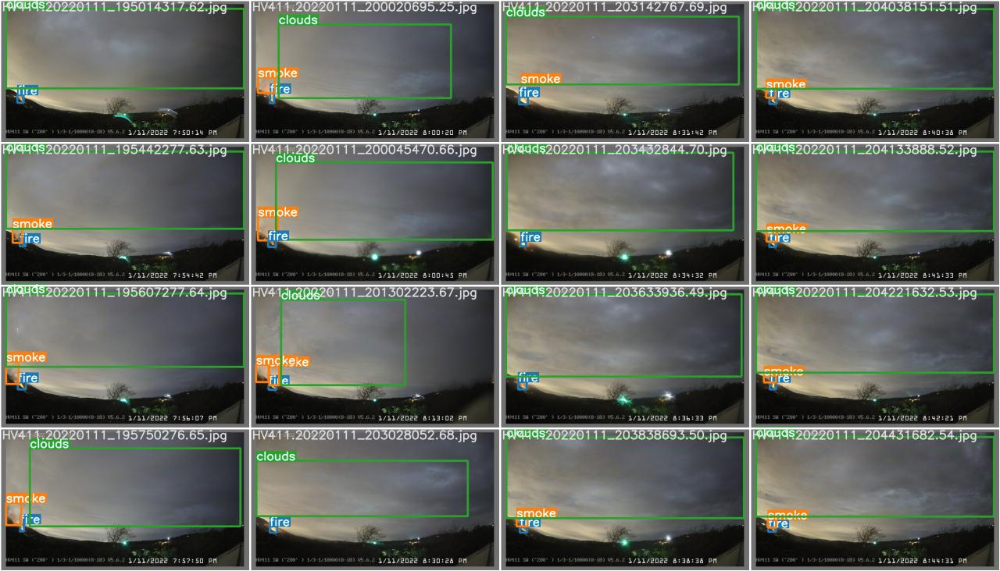
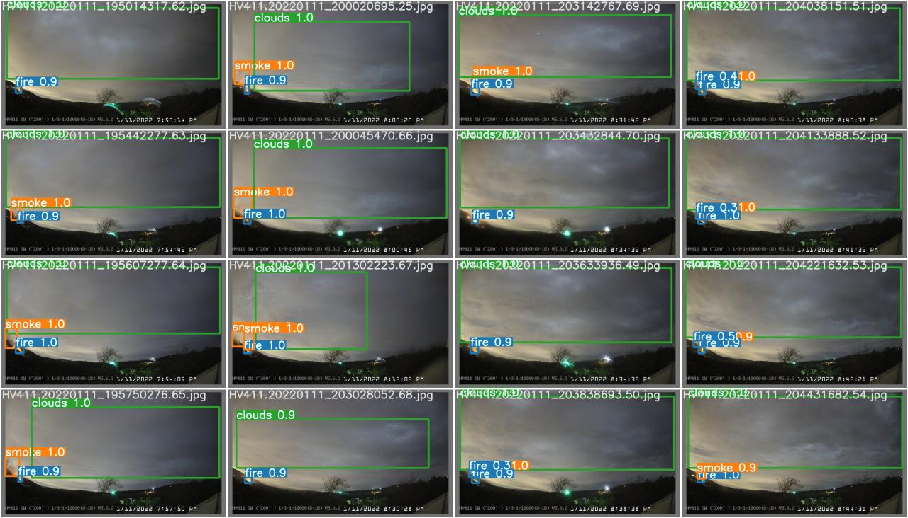
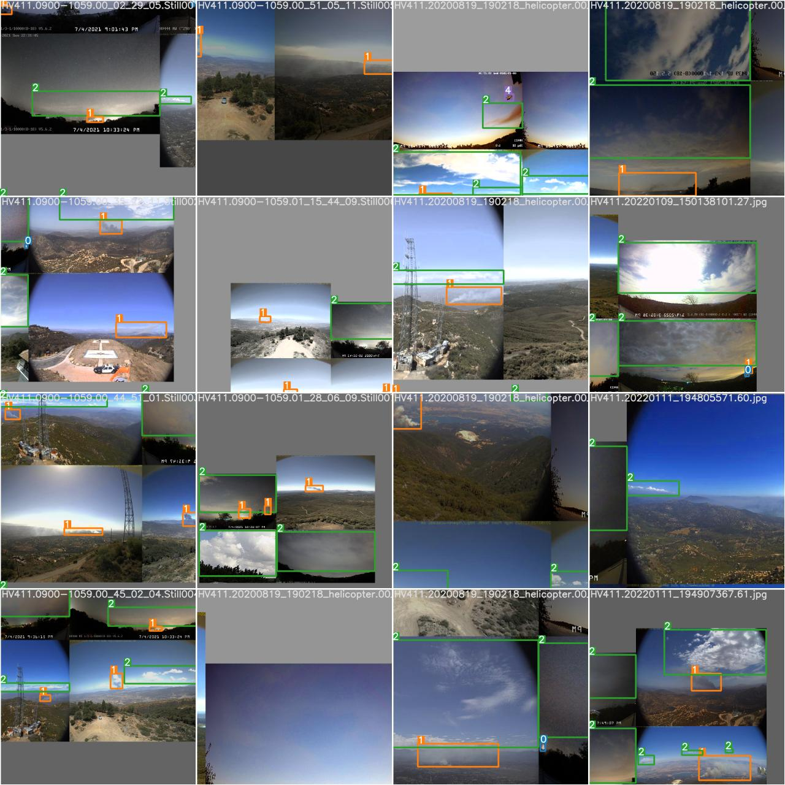
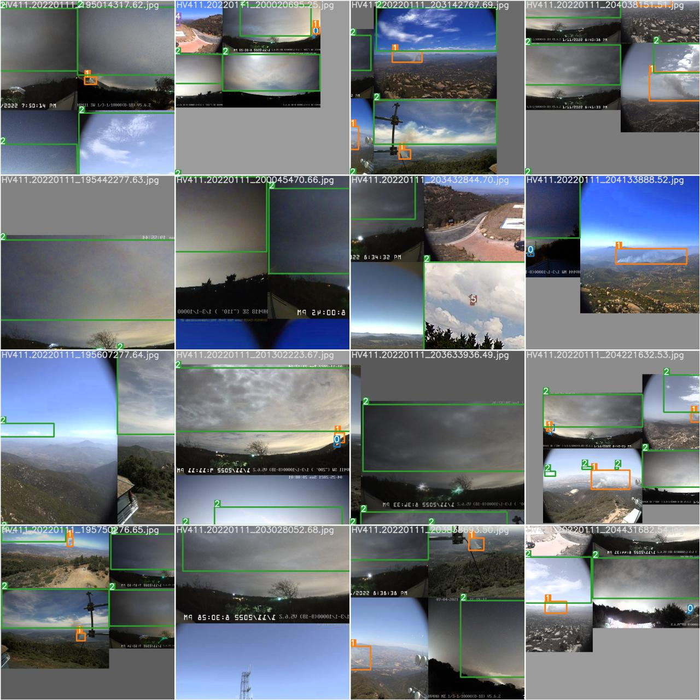
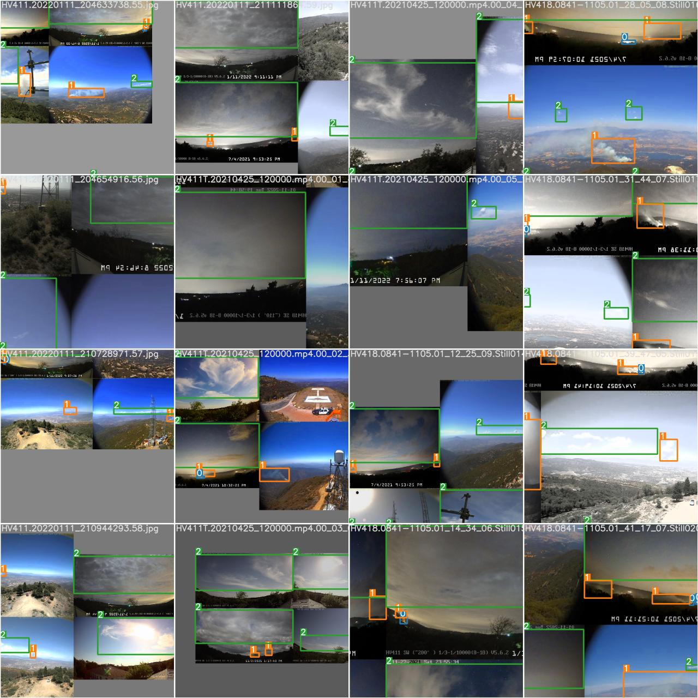